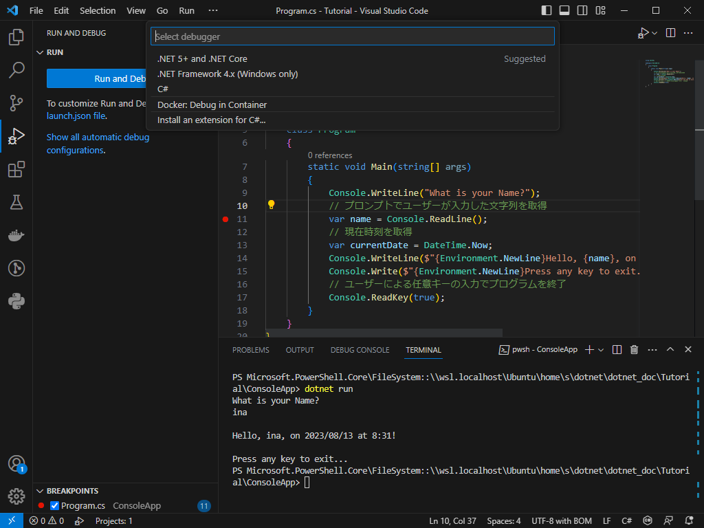

# チュートリアル: Visual Studio Code を使用して .NET コンソール アプリケーションを作成する

https://learn.microsoft.com/ja-jp/dotnet/core/tutorials/with-visual-studio-code?pivots=dotnet-7-0

## アプリを作成する
```
dotnet new console -o ConsoleApp -f net7.0
```

# チュートリアル: Visual Studio Code を使用して .NET コンソール アプリケーションをデバッグする

https://learn.microsoft.com/ja-jp/dotnet/core/tutorials/debugging-with-visual-studio-code?pivots=dotnet-7-0

## デバッグビルド構成の使用
- デバッグツールから `Run and Debug` の下にある `create a launch.json file` をクリック


- `.NET 5+ and .NET Core` を選択



- `launch.json`と`tasks.json`ファイルが作成されていることを確認


## ブレークポイントの設定


## ターミナル入力用の設定
- デバッグコンソールは、実行中のプログラムのターミナル入力を受け入れないため、デバッグ中にターミナル入力を処理するには、統合ターミナルまたは、外部ターミナルを使用する
- `launch.json`の`console`の設定を`internalConsole`から`integratedTerminal`に変更する

